# drawds

Sketch data structures live in front of a class, then step through algorithms on them one narrated step
at a time, at the teacher's pace. Built on the [tldraw SDK](https://tldraw.dev).

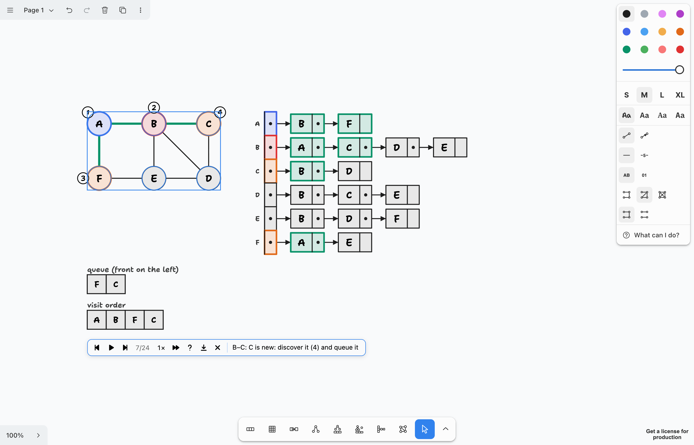

```bash
npm install
npm run dev        # then open the printed localhost URL
```

## Structures

Pick a tool (or press its shortcut) and press-and-drag: the structure grows as you drag, filled with values
you can retype. Each one is a single shape: move it, restyle it, undo it in one step.

<table>
<tr>
<td align="center" valign="bottom">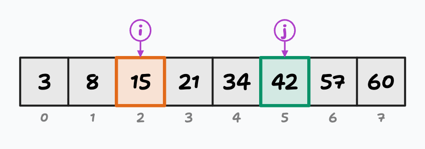<br><b>Array</b> <kbd>Shift</kbd>+<kbd>A</kbd><br>stacks, queues, fixed capacity</td>
<td align="center" valign="bottom">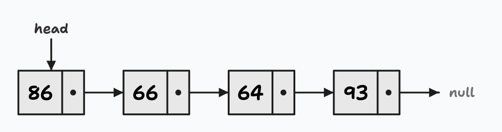<br><b>Linked list</b> <kbd>Shift</kbd>+<kbd>N</kbd><br>singly / doubly, tail, circular, sentinel</td>
</tr>
<tr>
<td align="center" valign="bottom">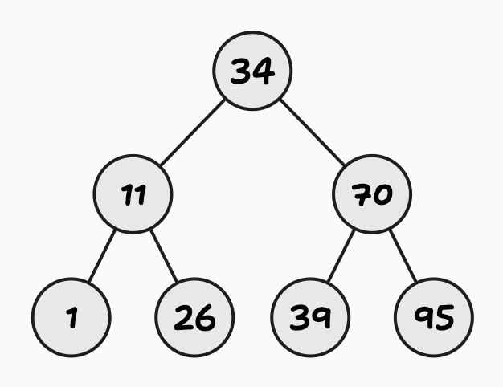<br><b>Binary tree / BST</b> <kbd>Shift</kbd>+<kbd>T</kbd><br>lean as you drag: a stick to a perfect tree</td>
<td align="center" valign="bottom">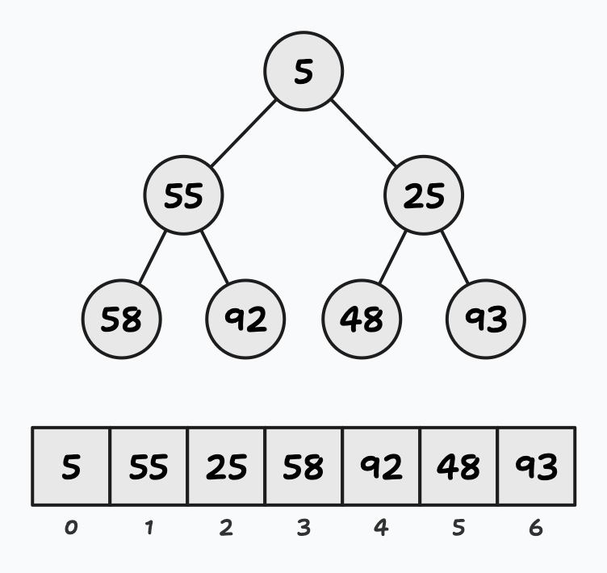<br><b>Heap</b> <kbd>Shift</kbd>+<kbd>P</kbd><br>the tree and its array at once</td>
</tr>
<tr>
<td align="center" valign="bottom">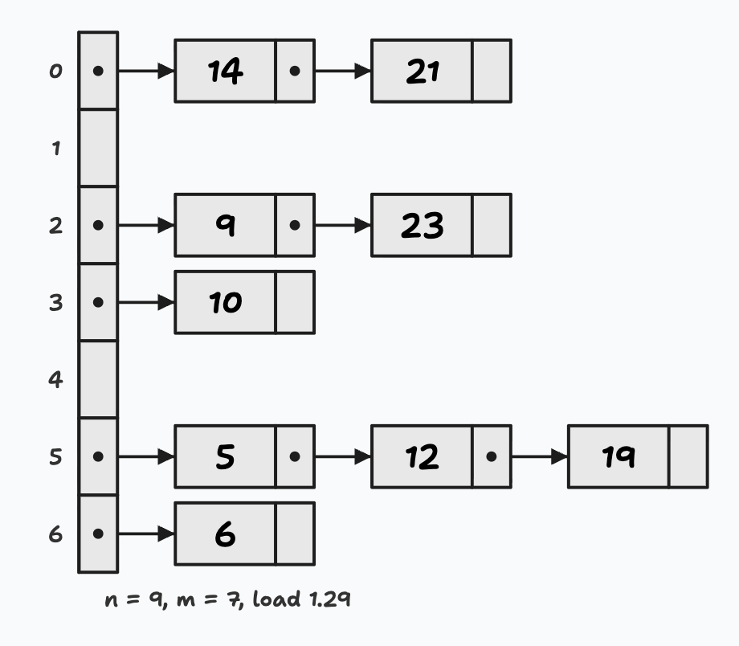<br><b>Hash table</b> <kbd>Shift</kbd>+<kbd>B</kbd><br>chaining or linear probing, load factor</td>
<td align="center" valign="bottom">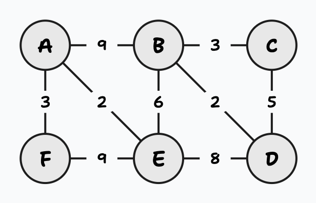<br><b>Graph</b> <kbd>Shift</kbd>+<kbd>G</kbd><br>directed or not, weighted or not</td>
</tr>
<tr>
<td align="center" valign="bottom">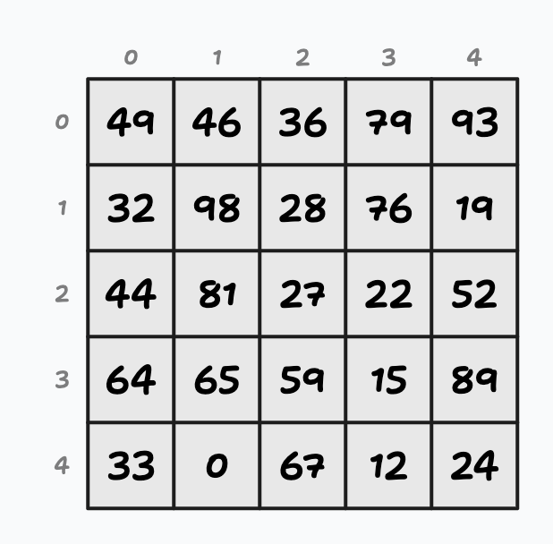<br><b>Matrix</b> <kbd>Shift</kbd>+<kbd>M</kbd><br>2D arrays, drag out a rectangle</td>
<td align="center" valign="bottom">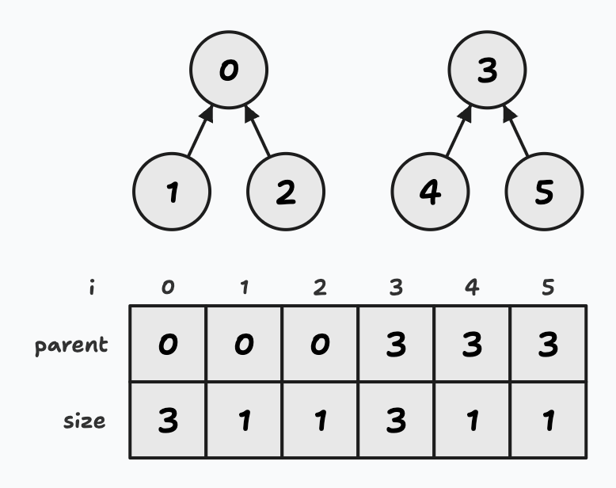<br><b>Union-find</b> <kbd>Shift</kbd>+<kbd>U</kbd><br>the forest over its parent array</td>
</tr>
</table>

A graph can show its **adjacency matrix**, **adjacency lists**, **edge list** or **union-find** beside it (right-click >
Show), each headed by what it costs (V × V cells, V + 2E entries, E pairs), and they follow it as it changes; Show >
degrees badges every node. The style panel's **What can I do?** lists every gesture, button and setting for the
selected structure.

## Step by step

Right-click an element or a structure: **Step by step** lists what can be played on it. An operation opens paused
on its first step, with a play bar under the structure: each step is a line of the code a teacher would write,
with pointers that slide, values that swap in arcs, cells that light up and running counts.

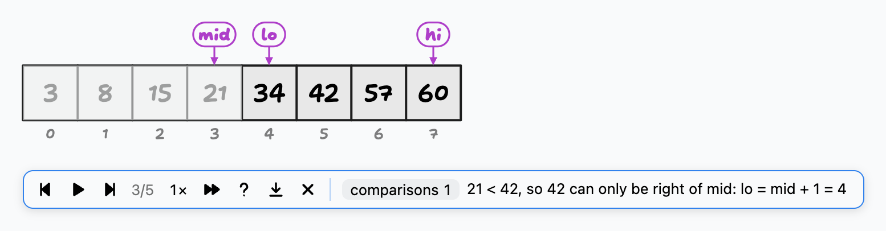

Step with <kbd>←</kbd> <kbd>→</kbd> (or a presentation clicker), <kbd>Space</kbd> plays and pauses, <kbd>Enter</kbd>
puts the result in (<kbd>Shift</kbd>+<kbd>Enter</kbd> keeps the highlights as marks), <kbd>Esc</kbd> cancels with
nothing changed. Once the result is in, the bar stays to step back through it or replay it. Autoplay and speed
(½× to 4×) are on the bar.

| Structure | Step by step |
|---|---|
| Array | binary and linear search; insertion, selection, bubble, quick and merge sort (selection and insertion also a row per pass, the costs summed); Lomuto, Hoare and three-way partitions; quicksort with a random pivot, the median of three, three ways or a cut-off to insertion sort; a sort's comparisons as n grows (n = 10, 100, 1000, four kinds of input); insert and delete by shifting; growing a full array (doubling against +1); recursive sums |
| Stack, queue | push, pop, peek; enqueue, dequeue, a circular buffer wrapping round; overflow and underflow |
| Linked list | find, insert, delete, append, insert in order, reverse, find the middle (slow and fast), print backwards, Floyd's cycle detection; a size field kept by every insert and delete, counting the nodes against reading it, the invariants checked, and the two bugs of forgetting the tail |
| Tree, BST, heap | pre-, in-, post- and level-order; BST search, insert, delete (all three cases); heap insert, extract, build-heap; Show > tree terms (root, internal, leaf, depth, height) |
| Hash table | insert, find, delete (tombstones when probing), grow and rehash |
| Graph | BFS, DFS, a path with the fewest edges, is there a cycle?, Dijkstra, Prim, Kruskal (with its union-find), topological sort, connected components; adding or removing a vertex or an edge, and what it costs the adjacency matrix, the lists and the edge list |
| Union-find, matrix | find with path compression, union by size or rank; row- and column-major order, transpose, staircase search |

### Recursion

A recursive operation grows its **recursion tree** beside the structure, call by call: the running call red, the
calls waiting on the stack orange, returned calls blue with their results. The tree stays afterwards, so two runs
can be set side by side (summing by halves goes log n deep, summing "last + the rest" n deep).

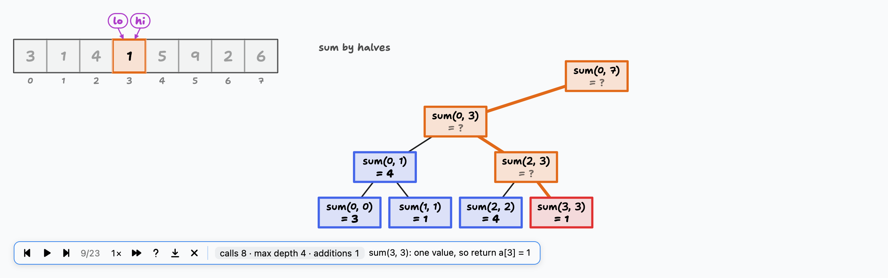

The **recursion tracer** (<kbd>Shift</kbd>+<kbd>R</kbd>) runs a function on the call stack: gcd, factorial, fib,
sum, or sayHello with no base case. Type a call into main's frame, run it, and watch frames go on the stack with
what they still have to do, the base case return, and the values come back down while the code lights its case.
Functions that never reach a base case overflow the stack; fib's tree marks the calls it makes again.

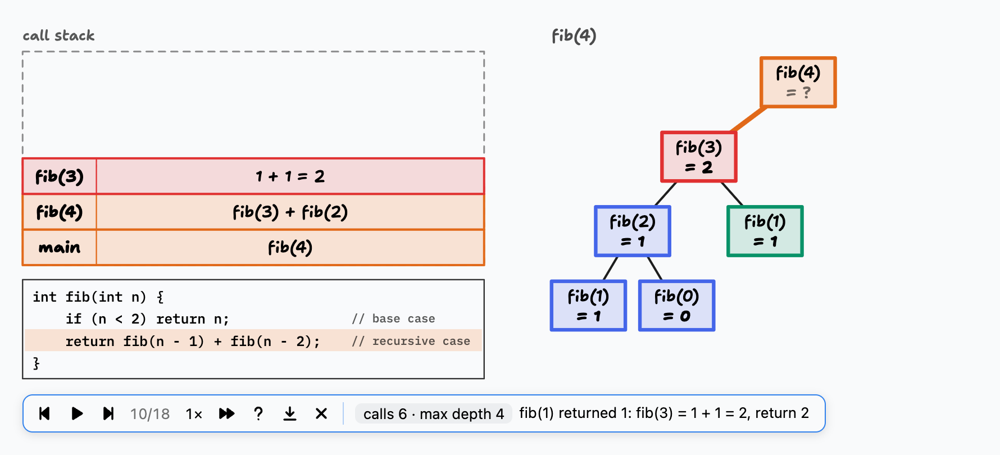

## Teaching with it

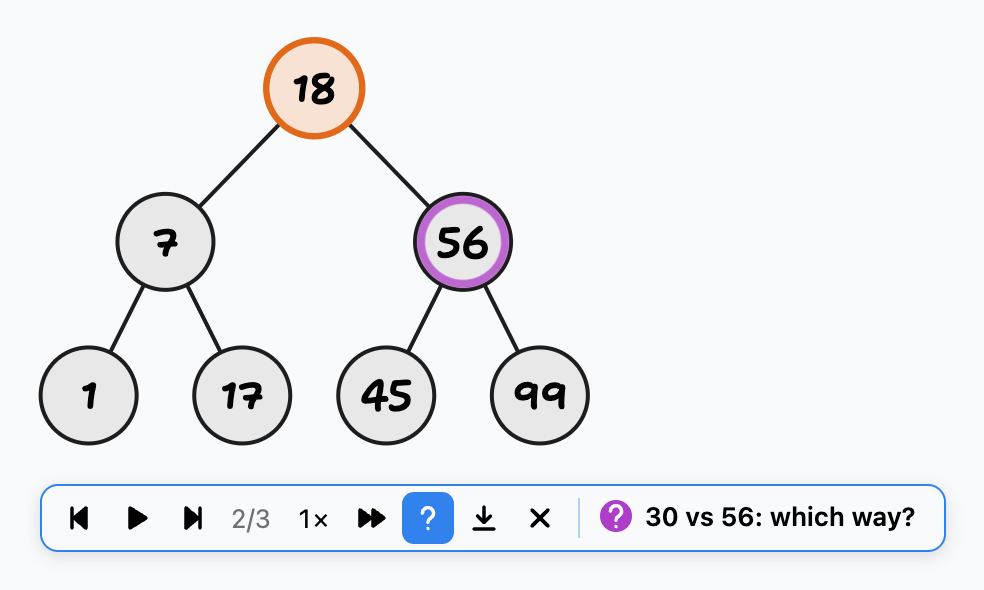

- **Predict mode** (the bar's <kbd>?</kbd>): each step is first a question for the class, its subject pulsing; the
  next press shows the answer.
- **Marks and pointers**: point at any element and press <kbd>1</kbd>–<kbd>4</kbd> (red, orange, green, blue;
  <kbd>0</kbd> clears); add named pointers (i, curr, root...) from the right-click menu and step them with the arrow keys.
- **Colour-blind cues** (main menu): every highlight colour also gets a shape, and marked edges a line pattern.
- **Lesson log** (main menu): every operation played in class is kept with the board, to replay or export afterwards.
- **Steps as images**: the bar's download button saves each step as a numbered image, for slides and notes.
- **Boards as files**: Open board / Save board (<kbd>Ctrl</kbd>+<kbd>O</kbd> / <kbd>Ctrl</kbd>+<kbd>S</kbd>) in the
  main menu, as tldraw `.tldr` files.

## Details

### Adding and removing elements

Select an array or list and a small **+** grip appears just past its end. Drag it outwards to add elements, one per
cell or node length, or back to remove them. Values you typed stay; new ones follow the shape's Fill mode. One undo
per drag; Esc cancels mid-drag. With an array selected, point at a cell for an **x** (delete) and a **+** on the
nearest boundary (insert).

Lists have more (with a mouse, a node's x and an arrow's + appear when you point at them; on touch screens they're
always shown):

- a second **+** grip before the head: drag it out to insert at the head, or back to remove from the head.
- a **+** on each arrow: click it to insert a node after the arrow's source. The new node opens for editing with a
  generated value selected: type to replace it, or press Enter / Esc to keep it.
- an **x** on each node: click it to remove that node; its predecessor now points to its successor.

Trees: point at a node to get a **+** on its lower-left / lower-right corner for each empty child slot and an **x**
that removes the node and its whole subtree. The layout tidies itself after each change and the root stays put.
BSTs and heaps have a **+** of their own to insert a key step by step, and an x on a node deletes it step by step.

Graphs: drag a node's connect grip onto another node for an edge, or into empty space for a new node and edge.

### Marking elements

Point at any cell or node (it doesn't need to be selected) and press **1** red (pivot), **2** orange (comparing),
**3** green (sorted) or **4** blue (visited); the same key again, or **0**, clears it. Right-click an element for
the same choices under **Mark**. Marks follow nodes when lists and trees change, travel with values when array
cells swap, and appear in exports. Digits typed while editing a value are just digits.

### Swapping array cells

Select an array: each cell gets a small handle underneath. Drag it onto another cell and the two values swap,
arcing past each other so students can follow. One undo per swap; Esc cancels.

### Fill

The style panel's **Fill** picker chooses how values are generated: random (all different), random with repeats,
empty, ascending, descending, nearly sorted, or letters, in a range of 0-2 (few values, many repeats), 0-9, 0-99,
0-999 or -50..50. Changing it on a
selected shape regenerates its values from the same random draw, so switching from random to ascending sorts the
same numbers (undo brings typed values back).

### Editing values

Double-click a cell or node (or select a shape and press Enter) to replace its value. Tab / Shift+Tab and the
arrow keys move between values, clicking another one jumps to it, Enter or clicking away finishes, and Esc reverts
the one you're on. Each edit is one undo step.

### Moving nodes

Select a linked list and drag the small handle under a node to move just that node; the arrows follow. Right-click
and choose **Re-layout** to put every node back in line. Graph nodes are dragged the same way.

## Development

```bash
npm test           # vitest: the pure layout and algorithm logic
npm run test:e2e   # Playwright against the dev server
npm run typecheck
npm run build
```

The README's images come from the app itself: `.claude/skills/run-drawds/driver.mjs` drives it headless, and its
`shot` command (with `SCALE=2`) saves just the drawing.
